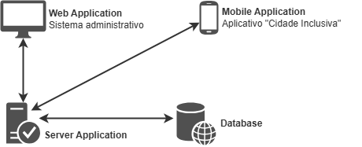

# 🌆 Projeto Cidade Inclusiva - Painel Administrativo

O projeto "Cidade Inclusiva - Painel Administrativo" visa melhorar a mobilidade urbana para cadeirantes. Este painel permite que administradores gerenciem e monitorem dados essenciais para criar uma cidade mais acessível e inclusiva.

## 📚 Documentação de Apoio

| 📄 Descrição | 🔗 Link |
|:---|:---|
| Desenvolvimento do Plano de Trabalho | [Plano de Trabalho](https://docs.google.com/document/d/1nRhvRcXlDFgf7TtoWgm3VRqlIvhKTE5sb9miVpVaVKU/edit?usp=sharing) |
| Documentação do Projeto Mobile | [Documentação Cidade Inclusiva](https://docs.google.com/document/d/1VxejBnzkMbvmlPWUQOMgSNrHDl5ugXdu/edit?usp=sharing) |
| 🎨 Protótipo Inicial no Figma | [Figma](https://www.figma.com/design/sHp0ryMHBTla6oVVEYJSOv) |
| 📱 Protótipo Mobile no Vercel | [Cidade Inclusiva - Mobile](https://fundect-pictec3-mobile-cidade-inclusiva.vercel.app/login) |
| 📂 Repositório Mobile no GitHub | [Cidade Inclusiva - Mobile](https://github.com/marcosrogerio-jrf/fundect-pictec3-mobile-cidade-inclusiva) |
| 🛠️ Modelagem UML do Projeto | [Cidade Inclusiva - UML](https://app.diagrams.net/#G1c72Gns79DE7laBVADoPoukr65F1AaNS-) |

## 🏗️ Estrutura do Projeto

### 🖼️ Arquitetura Base do Projeto "Cidade Inclusiva"



### 🛠️ Tecnologias Utilizadas

Lista de tecnologias utilizadas:

| 🚀 Tecnologia | 📖 Descrição | 🔗 Link de Acesso |
|:---|:---|:---|
| ⚛️ React | Biblioteca JavaScript para construção de interfaces de usuário. | [React](https://react.dev/) |
| 🌟 Next.js | Framework React para desenvolvimento de aplicações web com renderização do lado do servidor. | [Next.js](https://nextjs.org/) |
| 🎨 Tailwind CSS | Framework CSS utilitário para criar designs customizados rapidamente. | [Tailwind CSS](https://tailwindcss.com/) |
| ⌨️ TypeScript | Superset do JavaScript que adiciona tipagem estática ao código. | [TypeScript](https://www.typescriptlang.org/) |
| 🧩 shadcn/ui | Biblioteca de componentes UI para React, focada em acessibilidade e personalização. | [shadcn](https://ui.shadcn.com/) |
| ⚡ pnpm | Gerenciador de pacotes rápido e eficiente para JavaScript. | [pnpm](https://pnpm.io/) |
| ✅ Zod | Biblioteca de declaração e validação de esquemas. | [Zod](https://zod.dev/) |
| 📝 React Hook Form | Biblioteca para gerenciamento de formulários no React. | [React Hook Form](https://react-hook-form.com/) |

### 🔍 Ferramentas de Linting

Lista de ferramentas de linting utilizadas no projeto:

| 🛠️ Ferramenta | 📖 Descrição | 🔗 Link de Acesso |
|:---|:---|:---|
| 🧹 ESLint | Ferramenta de linting para identificar e corrigir problemas em código JavaScript/TypeScript. | [ESLint](https://eslint.org/) |
| 💅 Prettier | Ferramenta de formatação de código que garante um estilo consistente. | [Prettier](https://prettier.io/) |

### 🚀 Como Rodar o Projeto

#### Método Simplificado: Um Comando para Tudo

1. **Clone o repositório:**

    ```sh
    git clone https://github.com/MarcosRogerioFerreiraIFMS/cidade-inclusiva-adm-front-end.git
    ```

2. **Acesse o diretório do projeto:**

    ```sh
    cd cidade-inclusiva-adm-front-end
    ```

3. **Finalize com um único comando**

    Caso não tenha o pnpm instalado, execute:

    ```sh
    npm install -g pnpm
    ```

    Em seguida, com o comando abaixo, você pode preparar e rodar o projeto com apenas uma linha:

    ```sh
    pnpm first
    ```

Este comando realiza automaticamente as seguintes etapas:

1. Instala todas as dependências do projeto.
2. Inicia o servidor de desenvolvimento.

Após executar o comando, o servidor estará disponível em `http://localhost:3000`. 🎉

#### Método Manual: Passo a Passo

Caso prefira realizar as etapas manualmente, siga os passos abaixo:

1. **Clone o repositório:**

    ```sh
    git clone https://github.com/MarcosRogerioFerreiraIFMS/cidade-inclusiva-adm-front-end.git
    ```

2. **Acesse o diretório do projeto:**

    ```sh
    cd cidade-inclusiva-adm-front-end
    ```

3. **Instale as dependências:**

    Caso não tenha o pnpm instalado, execute:

    ```sh
    npm install -g pnpm
    ```

    Em seguida, instale as dependências do projeto:

    ```sh
    pnpm i
    ```

4. **Execute a aplicação:**

    ```sh
    pnpm dev
    ```

O servidor será iniciado em `http://localhost:3000`. 🎉
